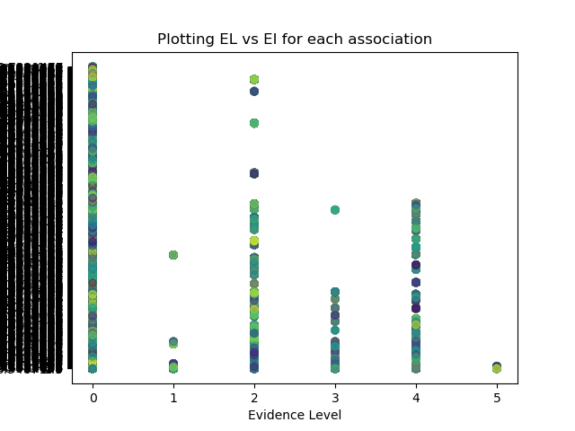
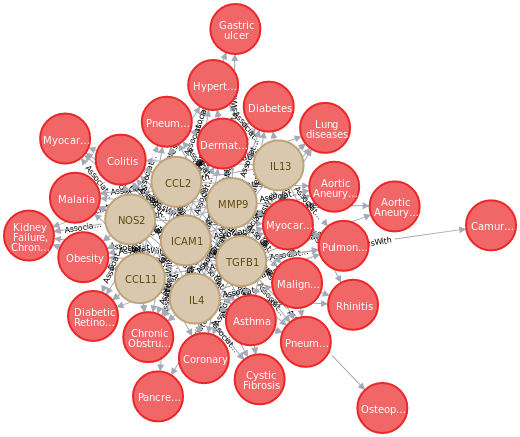

# This doc serves as a log of our research process

## 10/1 - 10/7 - Exploring Disgenet

We begin our exploration of what data is available to us - having decided to start with a well-defined scope, we settled upon Disgenet -- a database of disease gene associations.

The tables of interest to us at the moment are:
    - `geneDiseaseNetwork` - 
    - `geneAttributes` -
    - `diseaseAttributes` - 

### Data Info

While there are some attributes in these tables that are self explanatory, it's good to clarify and consolidate that information. We'll do a table-by-table analysis, also pulling in information from Disgenet's [database documentation](http://www.disgenet.org/dbinfo)

Reading their documentation, it's clear that they've taken great care when pulling from data sources, and have considered the issues that may arise when different databases store the same information differently. 

#### `geneAttributes`

- geneNID - Disgenet's own internal gene identifier
- geneId - NCBI Entrezgene identifier (When pulling from other data sources, Disgenet converts those that use "HGNC symbols and Uniport accession numbers" (other ways of identifying genes) to their appropriate NCBI Entrezgene identifiers. It's clear they're looking at a wide net of data.)
- geneName - gene symbol (entrez gene)
- uniprotId - "the Uniprot accession" - can search for protein associated with gene in Uniprot using this attribute
- Z - All are 0 (`select DISTINCT Z from geneAttributes;`)-
- P - All are 0 (`select DISTINCT P from geneAttributes;`)- possibly should be Panther protein class label
- pLI  - probability of being loss-of-function intolerant accoring to [GNOMAD](http://gnomad.broadinstitute.org/), the Genome Aggregation Database.
- DSI - [Disease Specificity Index](http://www.disgenet.org/dbinfo#section33) - reflects the size of the set of diseases the gene is associated with - ranges from 0.25 to 1. Low DSI means associated with more, high means associated with less. No DSI means gene is associated with only phenotypes.
- DPI - [Disease Pleiotropy Index](http://www.disgenet.org/dbinfo#section34) - similar to DSI, but considers that the diseases associated with a gene may be similar (belong to the same MeSH disease class) or completely different ones. DPI reflects the number of unique disease classes a gene is associated with - ranges from 0 to 1. (There are 29 unique disease classes in Disgenet). Low DPI means more of the associations are from the same set of disease classes, High DPI means the gene has associations that span more disease classes. No DPI value means the gene is associated only to phenotypes or associated diseases do not map to any MeSH classes.

#### `diseaseAttributes`
- diseaseNID - Disgenet's own internal gene identifier
- diseaseId - UMLS CUIs
- diseaseName - from the [UMLS Metathesaurus](https://www.nlm.nih.gov/research/umls/)
- type - phenotype, group, disease
    - disease: An entry that maps to following semantic types:
        - Disease or Syndrome
        - Neoplastic Process
        - Acquired Abnormality
        - Anatomical Abnormality
        - Congenital Abnormality
        - Mental or Behavioral Dysfunction 
    - phenotype: An entry that maps to the following semantic types:
        - Disease or Syndrome
        - Neoplastic Process
        - Acquired Abnormality
        - Anatomical Abnormality
        - Congenital Abnormality
        - Mental or Behavioral Dysfunction 
    - group: A disease entry that refers to the one of the following disease groups:
        - Cardiovascular Diseases
        - Autoimmune Diseases
        - Neurodegenerative Diseases
        - Lung Neoplasms
    - Any entry considered as a disease but not strictly a disease, like those belonging to:
        - Gene or Genome
        - Genetic Function
        - Immunologic Factor
        - Injury or Poisoning 
    are removed from Disgenet

#### diseaseClass

Represents the 29 [MeSH](https://meshb.nlm.nih.gov/treeView) classes of diseases

- diseaseClassNID - Disgenet's own internal identifier for the MeSH class
- vocabulary - the vocabulary set that includes this disease class (only value is MSH for MeSH)
- diseaseClass - the MeSH identifier for the disease class
- diseasClassName - the name of the disease class

#### disease2class

Links diseases to their appropriate disease class

#### geneDiseaseNetwork

Mapping the gene disease associations and metadata about those associations

- NID - association id
- diseaseNID - the internal ID for the disease
- geneNID - the internal ID for the gene
- source - the original source reporting the association (`select distinct source from geneDiseaseNetwork`)
- association 
- association type
- sentence - a sentence from the publication describing the association (if none exists, then the title is used)
- pmid - the (first?) publication that reports the association's Pubmed Id
- score - GDA score, ranges from 0 to 1 - 1 is good
- EL - evidence level - measures the strength of evidence of a gene-disease relationship that correlates to a qualitative classification: "Definitive", "Strong"(High Evidence), "Moderate", "Limited" (Low Evidence), "Conflicting Evidence", or "No Reported Evidence"
- EI - evidence index - indicates the existence of contradictory results in publications supporting the associations. "1" -> all publications support association, "<1" -> there are some publications that assert there is no association. No EI value means the index hasn't been computed.
- year - most likely assumed to be the first time the association was reported

## 10/8 - 10/15 - Further Data Exploration, SQLite, Scripts, Neo4j

Now that we have a better idea of what data is in Disgenet, and what the attribbutes for each table actually mean, we had a couple things we wanted to explore.

### Gene Disease Association - Evidence Level and Evidence Index

The evidence index reflects the number of published results that refute an association (EI = 1 means no evidence exists that contradicts it). The evidence level reflects the strength of evidence behind an association.

Having an EI of 1 for an association means much less if there's very limited evidence supporting it, especially compared to an association with the same EI with strong evidence. 

We wanted to explore this and see the distribution of the associations in Disgenet, comparing EL and EI. We plot the correlation in inquiry1. Notice the evidence levels, which are traditionally Strings, have been converted to numeric values. The following is a map of EL to its number in our plot: 

    {
        'no reported evidence': 0, 
        'moderate': 1, 
        'strong': 2, 
        'limited': 3, 
        'definitive': 4, 
        'disputed': 5
    }

Looking at the figure,

  
 
 we can see that there are associations at all levels where there is no reported evidence for the association, but an EI has been calculated. We likely aren't too concerned with these associations. Looking at the majority of the remaining associations, we can see the associations with 'Strong Evidence' or 'Definitive Evidence' tend to have lower EIs, but we do see some outliers here. Perhaps then, these associations with strong evidence are simply those that have been studied more heavily, and as a result just happen to have more studies that refute them, pushing EI down. 

Does score of the association directly correlate to EI? Or EL? These remain to be explored.

### Gene Disease Associations - Converting RDBMS data to Neo4j in automated fashion

Now that we have a better understanding of the data in Disgenet, we look to see how we might model that data as a Graph.

The intuition we follow is:
    - An entity is a node
    - A join-table is a relationship

#### A First Attempt at defining a Schema

Looking at gene-disease associations, we see that Gene and Disease serve as different types of data. They can be the Node Types of our graph. Then each row in the gene table becomes a node of the Gene node type, and the same holds for diseases. 

But do we really need copy over all the properties of a gene from the relational model? There are quite a few. We determine that we don't actualyply need Disgenet's internal identifier for the gene, and our model might actually be more flexible with future integrations if we consider only the Entrez gene id for the gene. The gene name would also be easily searchable, so we keep that as well. Values Z and P are 0 across all genes, so these don't seem useful to us. However, pLI, DSI, and DPI do have actual values, and espcially the latter two are calculated metrics related to diseases a gene is associated with.

With diseases, we will use the diseaseId (the UMLS CUI labell for the disease) as its identification. The disease name is also useful to us, along with perhaps the type. It would be nice to also use the disease class, but not all diseases have a disease class associated with them. We could definitely consider incorporating this data at a later time.

Now associations are join tables! We can join the associations table on the disease and gene tables by the internal gene and disease identifiers, and instead display entrez gene Ids and UMLS CUIs. That information is key to understanding the association. Metrics like associationType, association, EL, EI, and score, can help us better understand the validity of the association, and perhaps allow us to present data differently based on that association weight. 

Now we know what properties matter to us, we export SQL data for Gene, Disease, Association to CSV. Then we create the Gene Node Type, importing each gene record as a node, create the Disease Node Type, each disease record as a node, and then create a new relation between Gene and Disease for each association. In order to automate this process, we've written scripts to do this for us. See [the data folder](../data/) for the scripts to export the SQLite data to CSVs, and then create a Neo4j instance from those CSVs.

At a later time, we might want look into building a tool to create different models of the data dynamically, further abstracting developers from the SQL->CSV->Neo4J conversion process.

## 10/15 - 10/22 - A Bipartite Graph

With a model in Neo4j, we begin by looking at the associations between genes and diseases. The Neo4j browser makes it quick and easy to explore on the nodes in the graph looking. 

### Asking Questions

#### What genes are linked with Asthma?

This is a simple enough query, and we settle on asthma just to narrow our scope. The Cypher query: `match (g:Gene)-[a:AssociatesWith]->(d:Disease {diseaseName : "Asthma"}) return g, d;`

There are too many! We want to make some sense out of this data, and knowing that some of these associations have very low scores, we want to discount them. (We come back to this later.) 

We also want to narrow the gene set another way, prompting us to our next question:

#### What genes that are linked to Asthma are linked to other diseases?

We try to get an idea of this with the query: `match (d2:Disease)<-[b:AssociatesWith]-(g:Gene)-[a:AssociatesWith]->(d:Disease {diseaseName : "Asthma"}) return d2, g, d;`

(This query runs slowly). In addition we likely don't care about weak associations. Let's narrow our focus and instead ask:

#### What genes are linked with Asthma and some form of diabetes?

We ask this with: `match (d:Disease)<-[b:AssociatesWith]-(g:Gene)-[a:AssociatesWith]->(asthma:Disease {diseaseName : "Asthma"}) where d.diseaseName =~ ".* diabetes.*" return d, g, asthma;`

Our results are interesting! We see that some diseases have quite a bit of gene overlap, like 'Latent autoimmune diabetes mellitus in adult'. Others, not so much. 

Notice the question we're looking to ask has essentially become something along the lines of "How similar are two diseases?", looking to answer this questions by the number of common genes that have associations with both diseases.

#### What diseases are similar to Asthma?

Let's consider the diseases in our graph, but only the disease that are associated with more than 2 genes. For these diseases, we consider each gene that is associated with it as long as the gene is also associated with asthma.

`match (d:Disease) where size((d)<-[:AssociatesWith]-(:Gene)) > 2 with collect(d) as diseases match (d1:Disease)<-[b:AssociatesWith]-(g:Gene)-[a:AssociatesWith]->(asthma:Disease {diseaseName : "Asthma"}) where d1 in diseases return d1, g, asthma;`

This query may also break the browser. Here we can use the intuition that the association score should be decent, let's say 0.5. Our query then becomes:
`match (d:Disease) where size((d)<-[:AssociatesWith]-(:Gene)) > 2 with collect(d) as diseases match (d1:Disease)<-[b:AssociatesWith]-(g:Gene)-[a:AssociatesWith]->(target:Disease {diseaseName : "Asthma"}) where d1 in diseases and b.score > 0.5 and a.score > 0.5 return d1, g, target;`, which gives us:

This looks promising. Sure, the numbers we picked for association score, and number of associations is all arbitrary, but we can change those. We can make this more generic, so we need not look only at Asthma, but run this query against for all diseases. By making this a stored procedure or something that we can call programattically, we'll ensure that we can run this query dynamically.

See [here](./inquiry3/test.py) and [here](./inquiry3/proc.py)

#### What genes are similar to IL4?

We can flip our above query: 
`match (g:Gene) where size((g)-[:AssociatesWith]->(:Disease)) > 2 with collect(g) as genes match (g1:Gene)-[b:AssociatesWith]->(d:Disease)<-[a:AssociatesWith]-(target:Gene {geneName : "IL4"}) where g1 in genes and b.score > 0.5 and a.score > 0.5 return g1, d, target;`

We selected IL4 because it was a gene that appeared in the results of the previous query. Again, we've extracted this query into a generic procedure we can call in Python.

See [here](../app/test.py) and [here](../app/proc.py)

## 10/22 - 10/29 - Asking more Questions

Continuing from where we left off last week, we realized that our EL vs EI plot may not be the exact plot we want. Instead, we may want to do something where we compare association score and EI, and ask other questions as well.

### Gene - Association Details for Asthma and Diabetes side by side

#### What we want to ask:

For each association (with either Asthma or Diabetes), get EL , EI, score, num of publibcations, (also number of publications with contradictory results). Ideally the genes are rows, columns will be values for either gene.

#### First Steps - Genes associated with asthma

    select * from geneAttributes
    left join geneDiseaseNetwork using (geneNID)
    left join diseaseAttributes using (diseaseNID)
    where diseaseName == "Asthma";
    
We first explore this to get an idea of how to formualate our goal as a query. One thing we notice immediately from the results is NAT2 appearing multiple times (under different pubmed ids,, different years, but the same scores). Perhaps the score is calculated against the evidence that existed at the time of each publication, or perhaps it is updated every time a new publication with the association is added.

#### Genes associated with both Asthma and Diabetes

Ideally we would like to construct a table such that each gene appears on a row, with columns dedicated for each EL, EL, score for each disease. But this can vary depending on what gene we consider. Instead, we can place a row for each gene-disease association, for each article that makes the association.

    select geneId, geneName, diseaseId, diseaseName, pmid, el, ei, score, year from geneDiseaseNetwork
    left join geneAttributes using (geneNID)
    left join diseaseAttributes using (diseaseNID)
    where diseaseName == "Asthma" or diseaseName like "%diabetes%"
	order by geneId, diseaseId, score;

We could also extend this to get more high level information and group by diseases, so we get one entry per disease.

    select geneId, geneName, diseaseId, diseaseName, pmid, el, ei, score, year from geneDiseaseNetwork
    left join geneAttributes using (geneNID)
    left join diseaseAttributes using (diseaseNID)
    where diseaseName == "Asthma" or diseaseName like "%diabetes%"
	group by geneId, diseaseId, score;

#### Plotting EI vs Score

Score has seemed relatively ambiguous until now - "The score ranges from 0 to 1 and is computed according to the formula described in ‘Methods’ section. The DisGeNET score allows obtaining a ranking of GDAs and a straightforward classification of curated vs predicted vs literature-based associations since it stratifies the associations based on their level of evidence."

Evidence Index is calculated only using associations appearing in sources BeFree and PsyGeNET - "The "Evidence index" (EI) indicates the existence of contradictory results in publications supporting the gene/variant-disease associations. This index is computed for the sources BeFree and PsyGeNET, by identifying the publications reporting a negative finding on a particular VDA or GDA. Note that only in the case of PsyGeNET, the information used to compute the EI has been validated by experts. "

### Integrate GO Annotations

Now that we seem to have a simple schema for our graph database in Neo4j, we want to add another dataset, GO Annotations for gene functions. The bipartite graph we want to generate would now be extended as well. To find similar genes to a target gene, we would look at the children of that gene, i.e. the annotations the gene is involved in and the diseases it is associated with, and for those annotations and diseases, find genes that share those annotations/associations. We would do a similar workflow for diseases and annotations. This means we would have to change our stored procedure for producing the bipartite graph to become more generic to allow for future extensions.

The immediate benefit of adding GO Annotations - Are genes that are similar in function also similar by association? Or, are genes that are involved in certain functions also associated with the same set of diseases?

We add to our `setup.sh` the functionality to pull the human GO Annotations and unzip it.

Since the GAF file is a file of associations, we need to add a new node type to our database first - GO terms. Then the association will become a relationship between gene and GO term. Some things to consider:

    - GO Annotations:
        - "A GO annotation is a statement about the function of a particular gene. GO annotations are created by associating a gene or gene product with a GO term." from http://geneontology.org/docs/go-annotations/
        - From http://geneontology.org/docs/go-annotation-file-gaf-format-2.1/ ;
            - DB, DB Object ID, and DB Object Symbol all refer to the gene itself
            - GO ID - The ID for the GO Term it is associated with
            - Each annotation includes an evidence code to indicate how the annotation to a particular term is supported.
            - The Qualifier indicates that the gene is NOT related to, Contributes to, or Collocalizes with - Ideally we'll want to ignore the entries with NOT.

    - GO Terms:
        - Ideally what we want to do is add GO properly to our graph database. Since the GO is loosely hierarchical, and very much a graph in structure - we need a good way to programmatically add GOs along with GO-GO relationships - this is tough because we will need to handle obsolete GO terms. We will pull them from here: http://current.geneontology.org/ontology/go-basic.obo . For the time being we add GO terms as empty nodes, ignoring any relationships that a GO tag may have with other GO terms. Many genes may have the same GO, and so it's not a blocker for the simplest queries we'd like to ask. But for the time being, if gene A has GO term G1, and gene B has GO term G2, and G2 is a parent of G1, we wouldn't be able to make an insight about the similarity between gene A and B just yet.

    - We revisit this later to properly plan how to add GO Annotations to our graph model.

#### Visualizing Bipartite Graphs

Previously we learned how to write a complex query to get genes related to a gene by association with shared diseases, but simply running the query in Neo4j gave us very little control over what the output looked like, and we also wanted to look into writing stored procdures for neo4j. That was why we had written `test.py` and `proc.py` in the `app` folder. We thought placing these files there made sense as they would eventually serve as important logic for server-side code. 

We extend what we worked on before and looked into building a bipartite graph with `matplotlib` in away that would give us more control over the visualization of this Graph. It did! 

### 10/29 - 11/5

Much of the previous work done sets the stage for the next steps. Now having a query for generating essentially the pipartite graph from Python, we want to explore building a web application architecture to support queries to our graph database, and use these query results to generate a sort of interactive view on the front end.

#### Building a Web App 

##### Move visualization files

test.py and proc.py, originally in the app folder, had to be moved. Sure, these queries are examples of the types of queries we want to support, but at the time of writing them, the main intent was to get some sort of visualization of a bipartite graph, which we still believe is important. But we realize that in the future our front end is likely going to be doing this visualization work, so it would make sense to leave it out of server-side code. Still, these files are important, so they've been moved to the `inquiry3` folder, from the `app` folder (The link to them in 10/15 - 10/22 has been updated to reflect the new location).

##### Server Architecture

We consider the different workflows our project will have when working with Neo4j:
- Inserting data: Ideally we do this only when we add a new node type to our database (as well as all relationships each node of that type has with other nodes). 
- Retrieving data: This should be done by the website, which would serve to query our data and present it in an explorable format. We see that we will likely only be doing reads here.

Other considerations - it would also be nice to provide some sort of API that users may query directly without having to use the UI we provide.

##### Tentative Solution

- Use Flask to run an API server we can leverage. The API will have some prebuilt queries we run until we decide upon a better schema.

- React will be the front end. Dynamically generate gene/disease info by making API queries.

### 11/5 - 11/14

With a tentative web app now running, we decided that there were certain things the UI must have to truly be explorative.

These were:
    - Tables - to view lists of items in an ordered way
    - Links - links on certain elements that would dynamically pull all the details for an item

#### Server - New Endpoints

To support two new views, viewing all genes/diseases, we exposed two endpoints:
    - `gene` and `disease`, which supports paginated responses, in batches of 25.
        - This was important to us, since we didn't want to run a query and send over a lot of items in a list, when a user may not be interested in many
        - This allows the user to still query by page, and get all the results.

#### Client - Client-Side routing and Links (prelim)

To be able to support creating links for views that aren't specific files, we need to allow React to intercept URLs and pull all the information necessary to dynamically render the necessary components for the view. 

We are using `react-router-dom` to help do this.

#### Client - Fetching Asynchronous calls are hard

Although we have client side routing, fetching the necessary data from the API is still proving to be difficult. Querying the API works, but as I'm not familiar with the intricacies of React, specifically Promises, and how to manage state within Functions/Components, I'm still stuck on rendering dynamic lists and haven't quite figure out how to convert my Promise lists to JSArrays.

### 11/14 - 11/19

Most recently, we were facing issues with many aspects of the webapp - client-side routing and making API calls properly (working with Promises in JavaScript) was a bit intimidating to tackle. Perhaps more importantly, on the back end, the DB queries we were interested in were hardcoded specifically for the two entities, Gene and Disease.

#### Abstracting the Backend

Last week, the API had 4 endpoints, and this didn't change this week either. What did change, was the content within the response objects when `gene/geneName` and `disease/diseaseName` are called. For example, hitting `/gene/IL4'` now returns:

    {
        "GeneName": "IL4", 
        "Neighbors": {
            "Disease": [
                "Rhinitis", 
                "Asthma", 
                "Dermatitis, Atopic"
            ]
        }, 
        "RelatedGenes": {
            "RelatedByDisease": [
                "ICAM1", 
                "NOS2", 
                "IL5", 
                "CCL5", 
                "IL13", 
                "MMP9", 
                "IL13"
            ]
        }
    }

The "Neighbors" concept is new. Realizing that our graph might grow and there may be new node types added, we decided that we would like to be able to get associations not between genes and diseases, but also genes and their GO Annotations as well. `Disease` and `GO Annotation`, then, are neighbors to `Gene`. Our db query function was no longer something that said "get me all diseases associated with this gene", but rather "give me all neighbors of nodetype `nt` associated with this gene", where `nt` is in ['Disease', 'GO Annotation']. While we still haven't extended the database to incorporate new nodetypes, our DB queries are generic, and each `Dao` passes in the Entity specific local schema to the query, containing information about which neighbor to consider, what the directionality of the relationship is. The onus is then on the Dao to pass the right information to the querier. 

Essentially the queries were changed:
- query for getting genes/diseases were merged into a query for getting entities (gene/disease and page number) would be provided
- query for getting associated diseases/genes for a specific gene/disease were merged into a query for getting neighbors of an entity
- query for getting genes/disease similar to a specific gene/disease were merged into a query for getting entities similar to a specific entity via a specific neighbor type.

There's still improvement for further abstraction, as each Dao now has to know the schema, and everytime we have a new entity, we have to create a new schema dicionary for the Dao to rely on. Ideally, if we could leverage the config.json and rely on that, then there may need to be only one Dao object that looks at the schema. We hope to revisit this later, but for now, the API is more robust than it was before.

#### Fixing the Front-End

With the API now solidified and the response object providing data in a more extensible manner, we revisited the client. Leveraging `react-router-dom` last time, we were able to define many routes, but we had run into issues with 1) pulling the data from our API and 2) rendering that data. We also had issues with using functional React but wanting to maintain state,
to keep track of page numbers (for the gene list and disease list).

Reaching out to some peers who were more familar with React, we learned about `useState()` and `useEffect()`. `useState()` allows us to store page number and the current gene/disease list, with some initial values. We leverage `useEffect()` to call a function that fetches data from our API asynchronously and once a response is returned, we update or append to the gene list, and the component is able to re-render with the list. This laid the groundwork for rendering genes and diseases. Each item in the list is a clickable link that will route the app to render the information for that specific gene/disease.

For this gene/disease specific view, we refactored where we left off last week, again leveraging `useState()` and `useEffect()` to fetch the information from the API asynchronously and re-render the component once the data was received. But clicking the links didn't take us to the route we actually wanted, and so we weren't able to see the information for a disease if we went to the gene first and vice versa. This was actually a minor issue that was a result of appending the desired URL to the current path every time. Once this was figured out, we worked to split up our components, so `App.js` wasn't cluttered.

Next steps include actually incorporating the table view using `react-table`. There are live examples of what a table with sort by column might look like, but have yet to incorporate it into out client.